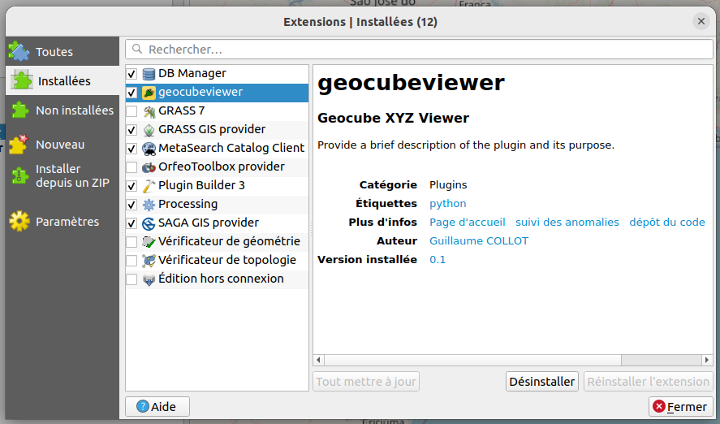
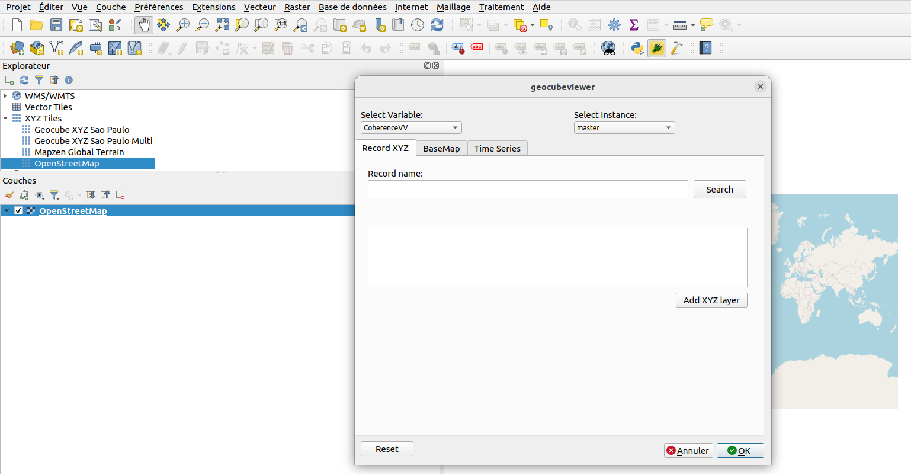
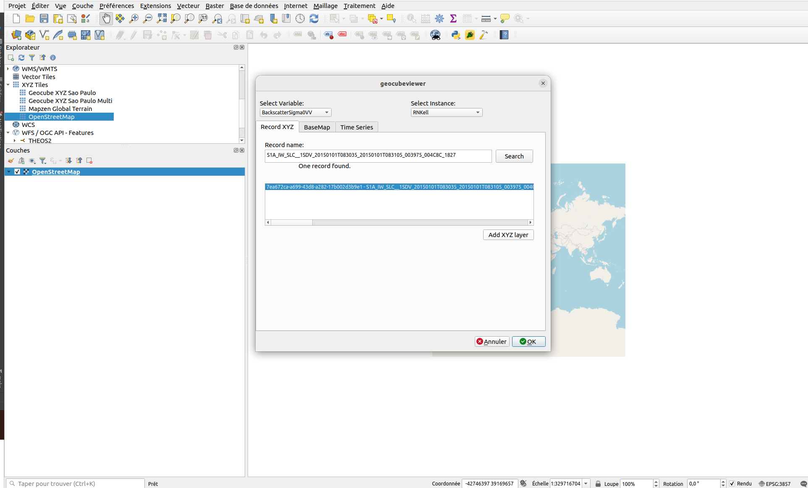
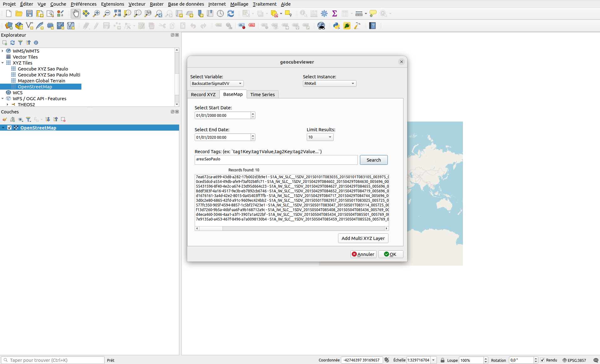
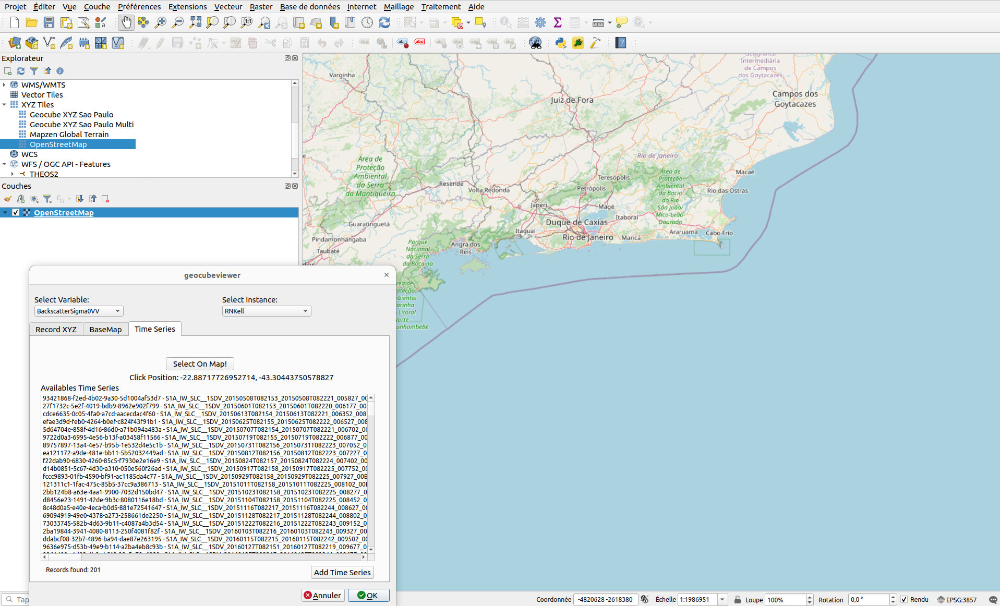
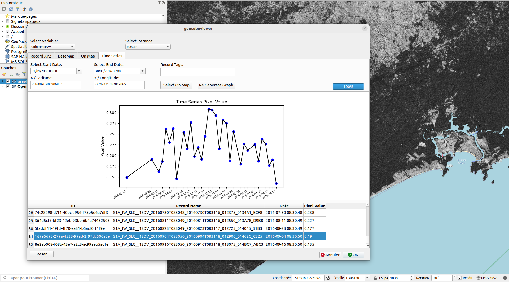

# Geocube Viewer

Geocube Plugin for QGIS

Enable to connect to XYZ Geocube Tile Server.

- From records
- From Tags and Date Range
- By selecting point area on map

## Installation 

- Download Plugin archive [here](https://code.webfactory.intelligence-airbusds.com/geocube/geocube-viewer.git)

```bash
git clone https://code.webfactory.intelligence-airbusds.com/geocube/geocube-viewer.git
```

- Add plugin in to QGIS local repository `~/.local/share/QGIS/QGIS3/profiles/default/python/plugins`


- Open QGIS. Click on Plugins ‣ Manage and Install Plugins…. to open the Plugins dialog.

- Go to installed and enable GeocubeViewer plugin



## Configuration

in `Préférences` > `Options` > `Système`

Add environment variables `GEOCUBE_SERVER`, `GEOCUBE_CLIENTAPI` and `GEOCUBE_AUTH_CONFIG_ID`: QGIS ID of authentification configuration which is needed by client to request Geocube Server (findable in Préférences/Options/Authentification)

## Start

- Now you can start Geocube Plugin:



## Utilisation

### From record name

1. Select Variable and Instance
2. Add record Name
3. Click on Search
4. Select Right record 
5. Add QGIS layer



### From Tags and Date Range

1. Select Variable and Instance
2. Select dateRange
3. (optional) Add tags filter 
4. Click on Search
5. Add all corresponding record as single QGIS Layer



### By selecting point area on map

1. Select Variable and Instance
2. Select Point on Map by clicking on Select on map
3. Select wanted record
4. Add QGIS Layer



### Time Series

1. Select Variable and Instance
2. Select Time Range and Tags
3. Select Point on Map by clicking on Select on map
4. Click on Graph to generate time series graphic
5. Click on Graph Point in order to display WMTS corresponding layer



## Debug

Log file (geocubeviewer.log) is written into temp folder.

Crash QGIS trace can also be found (qgis-python-crash-info-{ID})